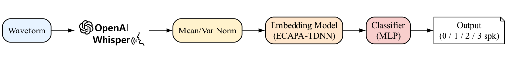

# 🎙️🔀 Speech separations ➡️ 🗣️🗣️🗣️ with variable number of 🎧🔉 sources
Audio source separation model with a Whisper ECAPA-TDNN  counter and SepFormer model, implemented with SpeechBrain.

Many conversational AI tasks such as speaker diarization, ASR, and voice-command activation suffer from overlapping recordings. This is a challenging issue, yet most speech separation systems handle only a fixed number of speakers. The goal of this project is to build a data simulator for a multi-speaker dataset, experiment with different speaker counter deep learning models, and finally separate up to three concurrent speakers in single‑channel audio. We first mix up to three speakers from  [LibriSpeech‑clean](https://www.openslr.org/12) utterances with [OpenRIR](https://www.openslr.org/28/) reverberation and noise. Our experimental speaker counter-models consist of an X-Vector, ECAPA‑TDNN and OpenAI's self-supervised ASR model [Wisper](https://openai.com/index/whisper/) based feature extractor in front of your ECAPA-TDNN. We predicted the speaker count with **Whisper_ECAPA_TDNN** has **96.33%** clip‑level accuracy. Based on this estimate, we selected a pre‑trained  [speechbrain/sepformer-libri3mix](https://huggingface.co/speechbrain/sepformer-libri3mix) and [speechbrain/sepformer-wsj02mix](https://huggingface.co/speechbrain/sepformer-wsj02mix) for speech separation. We have experimented with how these models process input mixtures and produce multiple output records, each ideally containing only one speaker with standard speech separation quality metric  [SDR ( Signal-to-Distortion Ratio)](https://github.com/mir-evaluation/mir_eval) and listening test with a small group of separated signals sound.

#### **Approach and Contributions**

In this project, we experiment with a two-step solution:
1. A supervised speaker count estimator to predict the number of speakers:

    * Design an open-source data simulator that randomly mixes up to three **LibriSpeech-clean-100** utterances, augments them with **OpenRIR** room impulse responses and noise, and balances the 0/1/2/3-speaker classes.

    * Benchmark three embedding model
      - X-Vector
      - ECAPA-TDNN
      - Whisper-ECAPA-TDNN: Fine-tuned ECAPA-TDNN instead of MFCC frontend.

2. A specialised pre-trained Sepformer for the predicted count.

#### **Experimental Setup and Key Findings**

- The simulator produced **~16h of training mixtures** and a balanced training,validataion and test set.
- Our best **Wispere_ECAPA_TDNN**-based counter achieved **96.33% clip-level** accuracy
- Coupling this with SpeechBrain’s sepformer-wsj02mix and sepformer-libri3mix model yielded an average **97.62 dB SDR** for three speaker and **3.96 dB** excluding single speaker.
- A subjective listening test with 5 participants confirmed perceptual improvements in 86% of clips.

## **Methodology**

#### **Data Simulator**

* We have done extensive research about previous efforts to generate a multispeaker dataset. Some of the notable work:

| Dataset          | #Spk | Source speech     | Link                                                                 |
|------------------|------|-------------------|----------------------------------------------------------------------|
| Libri2Mix / Libri3Mix       | 2 /3   | LibriSpeech-clean | [Github](https://github.com/JorisCos/LibriMix) [Paper](https://arxiv.org/abs/2005.11262?utm_source)|
| MiniLibriMix      | 2  ; < 1GB  | LibriSpeech-clean | [Source](https://zenodo.org/records/4020529)|

* Mixing algorithm
* Class-balance strategy
* Target metadata JSON schema
* Flowchart of the mixing pipeline

#### **Pre-processing & Features**
* Resampling (16 kHz)
* log-mel FBANK extraction 
* Mean-variance CMVN per clip
* Example mel-spectrogram

#### **Speaker-Counting Models**

* x-vector.
* ECAPA-TDNN.
* Wisper-ECAPA-TDNN.
* Architecture diagram.

#### **Separation Back-end**

* Pre-trained sepformer-wsj02mix
* Pre-trained sepformer-libri3mix

#### **Evaluation Metrics & Protocol**

* Clip-level accuracy
* Confusion-matrix heat map
* Precision, recall,macro-F1 for counting
* SDR (Signal-to-distortion ratio)
* SIR (Signal-to-inference ratio)
* SIR (Signal-to-Artifact ratio)

